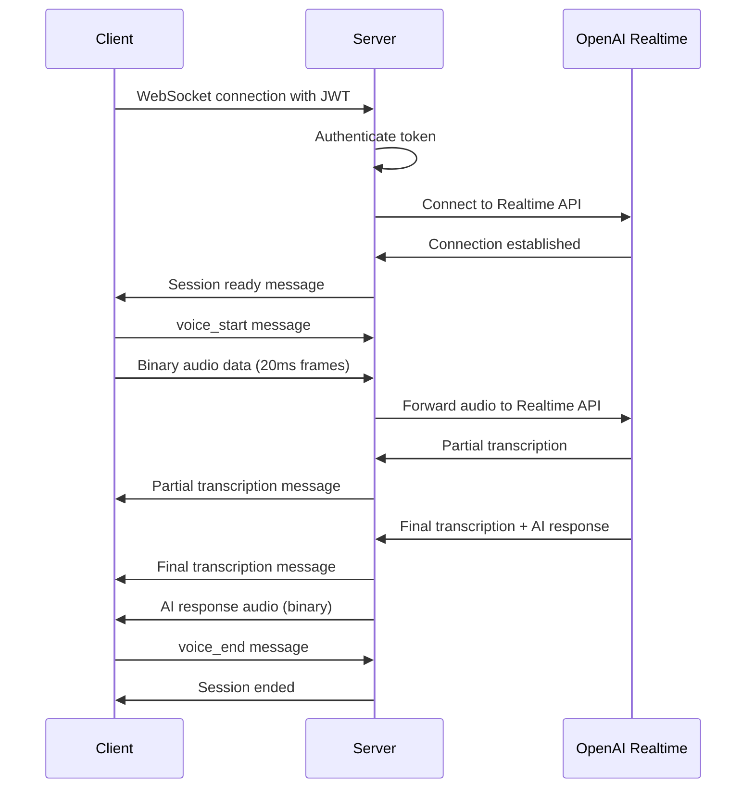

# Voice API Documentation

## Overview

Complete API documentation for SiteSpeak's real-time voice interaction system. This API provides low-latency voice conversations with AI assistants, supporting both REST and WebSocket protocols.

## Base URLs

- **Development**: `http://localhost:5000/api/v1/voice`
- **Production**: `https://api.sitespeak.ai/v1/voice`
- **WebSocket**: `ws://localhost:5000/voice-ws` (dev) / `wss://api.sitespeak.ai/voice-ws` (prod)

## Authentication

All voice API endpoints require JWT authentication.

### JWT Token Structure

```json
{
  "tenantId": "uuid-tenant-id",
  "siteId": "uuid-site-id",
  "userId": "uuid-user-id",
  "iat": 1699123456,
  "exp": 1699209856
}
```

### Authentication Methods

#### 1. HTTP Header (Recommended)

```http
Authorization: Bearer <jwt-token>
```

#### 2. Query Parameter (WebSocket only)

```plaintext
ws://localhost:5000/voice-ws?token=<jwt-token>
```

#### 3. Socket.IO Auth (Socket.IO only)

```javascript
const socket = io('/voice', {
  auth: { token: '<jwt-token>' }
});
```

## REST API Endpoints

### 1. Session Management

#### Create Voice Session

```http
POST /api/v1/voice/session
```

**Request Body:**

```json
{
  "tenantId": "550e8400-e29b-41d4-a716-446655440001",
  "siteId": "550e8400-e29b-41d4-a716-446655440002",
  "userId": "550e8400-e29b-41d4-a716-446655440003",
  "config": {
    "locale": "en-US",
    "voice": "alloy",
    "maxDuration": 300
  }
}
```

**Response:**

```json
{
  "success": true,
  "data": {
    "sessionId": "voice-session-1699123456789-abc123",
    "ttsLocale": "en-US",
    "sttLocale": "en-US",
    "expiresIn": 300,
    "expiresAt": "2025-01-15T10:30:00.000Z",
    "voice": "alloy",
    "audioConfig": {
      "sampleRate": 48000,
      "frameMs": 20,
      "inputFormat": "opus",
      "outputFormat": "pcm16",
      "enableVAD": true
    },
    "endpoints": {
      "websocket": "/api/v1/voice/stream?sessionId=voice-session-1699123456789-abc123",
      "sse": "/api/v1/voice/stream?sessionId=voice-session-1699123456789-abc123&format=sse"
    }
  },
  "metadata": {
    "timestamp": "2025-01-15T10:25:00.000Z",
    "correlationId": "req-1699123456-abc123"
  }
}
```

**Error Response:**

```json
{
  "error": "Validation failed",
  "code": "VALIDATION_ERROR",
  "correlationId": "req-1699123456-abc123",
  "details": {
    "body": [
      {
        "path": "siteId",
        "code": "invalid_string",
        "message": "Invalid uuid"
      }
    ]
  }
}
```

#### Get Session Status

```http
GET /api/v1/voice/session/{sessionId}
```

**Response:**

```json
{
  "success": true,
  "data": {
    "sessionId": "voice-session-1699123456789-abc123",
    "status": "active",
    "createdAt": "2025-01-15T10:25:00.000Z",
    "lastActivity": "2025-01-15T10:27:30.000Z",
    "expiresAt": "2025-01-15T10:30:00.000Z",
    "metrics": {
      "totalTurns": 5,
      "averageResponseTime": 280,
      "audioFramesProcessed": 1250,
      "errors": 0
    },
    "config": {
      "locale": "en-US",
      "voice": "alloy",
      "enableVAD": true
    }
  }
}
```

#### End Voice Session

```http
DELETE /api/v1/voice/session/{sessionId}
```

**Response:**

```json
{
  "success": true,
  "data": {
    "sessionId": "voice-session-1699123456789-abc123",
    "ended": true,
    "finalMetrics": {
      "duration": 180,
      "totalTurns": 8,
      "averageResponseTime": 265,
      "satisfactionScore": 4.5
    }
  }
}
```

### 2. Health & Status

#### Voice System Health

```http
GET /api/v1/voice/health
```

**Response:**

```json
{
  "status": {
    "isRunning": true,
    "activeSessions": 15,
    "performance": {
      "avgFirstTokenLatency": 285,
      "avgPartialLatency": 145,
      "avgBargeInLatency": 48,
      "errorRate": 0.02
    }
  },
  "timestamp": "2025-01-15T10:30:00.000Z",
  "version": "1.0.0",
  "components": {
    "orchestrator": "healthy",
    "transport": "healthy",
    "realtime": "healthy",
    "audioProcessing": "healthy",
    "visualFeedback": "healthy"
  }
}
```

#### System Metrics

```http
GET /api/v1/voice/metrics
```

**Response:**

```json
{
  "timestamp": "2025-01-15T10:30:00.000Z",
  "performance": {
    "activeConnections": 25,
    "totalSessions": 1250,
    "averageLatency": 275,
    "throughput": {
      "messagesPerSecond": 450,
      "audioFramesPerSecond": 2400
    }
  },
  "resources": {
    "memoryUsage": 85.5,
    "cpuUsage": 45.2,
    "networkBandwidth": 125.8
  },
  "errors": {
    "total": 12,
    "rate": 0.015,
    "types": {
      "connection": 5,
      "audio": 3,
      "ai": 4
      }
  }
}
```

### 3. Text-to-Speech

#### Generate Speech

```http
POST /api/v1/voice/tts
```

**Request Body:**

```json
{
  "text": "Hello, how can I help you today?",
  "voice": "alloy",
  "locale": "en-US",
  "format": "pcm16",
  "speed": 1.0
}
```

**Response:**

```json
{
  "success": true,
  "data": {
    "audioUrl": "/api/v1/voice/audio/tts-1699123456789-abc123.wav",
    "duration": 2.5,
    "format": "pcm16",
    "sampleRate": 48000,
    "metadata": {
      "text": "Hello, how can I help you today?",
      "voice": "alloy",
      "generatedAt": "2025-01-15T10:30:00.000Z"
    }
  }
}
```

### 4. Tools & Actions

#### Get Available Tools

```http
GET /api/v1/voice/tools?siteId={siteId}
```

**Response:**

```json
{
  "success": true,
  "data": {
    "tools": [
      {
        "name": "search_site",
        "description": "Search the website content",
        "category": "search",
        "parameters": {
          "query": {
            "type": "string",
            "description": "Search query",
            "required": true
          }
        }
      },
      {
        "name": "navigate_to_page",
        "description": "Navigate to a specific page",
        "category": "navigation",
        "parameters": {
          "page": {
            "type": "string",
            "description": "Page to navigate to",
            "required": true
          },
          "path": {
            "type": "string",
            "description": "Optional path",
            "required": false
          }
        }
      }
    ],
    "totalTools": 20,
    "categories": ["search", "navigation", "forms", "ecommerce", "booking"]
  }
}
```

#### Execute Tool

```http
POST /api/v1/voice/tools/execute
```

**Request Body:**

```json
{
  "sessionId": "voice-session-1699123456789-abc123",
  "toolName": "search_site",
  "parameters": {
    "query": "pricing information"
  }
}
```

**Response:**

```json
{
  "success": true,
  "data": {
    "toolName": "search_site",
    "result": {
      "results": [
        {
          "title": "Pricing Plans",
          "url": "/pricing",
          "snippet": "Our flexible pricing plans start at $9/month..."
        }
      ],
      "totalResults": 5
    },
    "executionTime": 156,
    "timestamp": "2025-01-15T10:30:00.000Z"
  }
}
```

## WebSocket API

### Connection Endpoints

#### Raw WebSocket (Binary Audio)

```plaintext
ws://localhost:5000/voice-ws?token=<jwt-token>
```

#### Socket.IO (JSON Messages)

```javascript
const socket = io('/voice', {
  auth: { token: '<jwt-token>' }
});
```

### Message Types

#### 1. Session Control Messages

##### Session Ready

**Direction**: Server → Client

```json
{
  "type": "ready",
  "data": {
    "sessionId": "voice-session-1699123456789-abc123",
    "realtimeSessionId": "rtc-session-abc123",
    "capabilities": ["audio", "text", "vad", "barge_in"]
  },
  "metadata": {
    "timestamp": 1699123456789
  }
}
```

##### Session Error

**Direction**: Server → Client

```json
{
  "type": "error",
  "data": null,
  "metadata": {
    "error": "Authentication failed",
    "code": "AUTH_FAILED",
    "timestamp": 1699123456789
  }
}
```

#### 2. Audio Messages

##### Voice Start

**Direction**: Client → Server

```json
{
  "type": "voice_start",
  "metadata": {
    "sessionId": "voice-session-1699123456789-abc123",
    "sampleRate": 48000,
    "channels": 1
  }
}
```

##### Voice Data (Binary)

**Direction**: Client → Server

```plaintext
Binary ArrayBuffer containing 20ms Opus audio frame (960 samples at 48kHz)
```

##### Audio Response (Binary)

**Direction**: Server → Client

```plaintext
Binary ArrayBuffer containing PCM16 audio response from AI
```

##### Voice End

**Direction**: Client → Server

```json
{
  "type": "voice_end",
  "metadata": {
    "sessionId": "voice-session-1699123456789-abc123",
    "timestamp": 1699123456789
  }
}
```

#### 3. Transcription Messages

##### Partial Transcription

**Direction**: Server → Client

```json
{
  "type": "transcription",
  "data": "Hello, I'm looking for",
  "metadata": {
    "partial": true,
    "confidence": 0.85,
    "timestamp": 1699123456789
  }
}
```

##### Final Transcription

**Direction**: Server → Client

```json
{
  "type": "transcription",
  "data": "Hello, I'm looking for pricing information",
  "metadata": {
    "final": true,
    "confidence": 0.95,
    "language": "en-US",
    "timestamp": 1699123456789
  }
}
```

#### 4. Voice Activity Detection

##### VAD Start

**Direction**: Server → Client

```json
{
  "type": "vad",
  "data": "vad_start",
  "metadata": {
    "active": true,
    "audioStartMs": 1699123456789,
    "timestamp": 1699123456789
  }
}
```

##### VAD End

**Direction**: Server → Client

```json
{
  "type": "vad",
  "data": "vad_end",
  "metadata": {
    "active": false,
    "audioEndMs": 1699123456792,
    "timestamp": 1699123456792
  }
}
```

#### 5. AI Response Messages

##### AI Response (Text)

**Direction**: Server → Client

```json
{
  "type": "user_transcript",
  "data": "Our pricing plans start at $9 per month for the basic plan...",
  "metadata": {
    "latency": 285,
    "confidence": 0.98,
    "timestamp": 1699123456789
  }
}
```

#### 6. Navigation Messages

##### Navigate Command

**Direction**: Server → Client

```json
{
  "type": "navigation",
  "data": "{\"page\":\"pricing\",\"path\":\"/pricing\"}",
  "metadata": {
    "page": "pricing",
    "timestamp": 1699123456789
  }
}
```

#### 7. Barge-in Messages

##### Barge-in Detected

**Direction**: Server → Client

```json
{
  "type": "barge_in",
  "data": null,
  "metadata": {
    "timestamp": 1699123456789
  }
}
```

### Connection Flow



### Error Handling

#### Connection Errors

```json
{
  "type": "error",
  "data": null,
  "metadata": {
    "error": "Connection timeout",
    "code": "CONNECTION_TIMEOUT",
    "recoverable": true,
    "retryAfter": 5000,
    "timestamp": 1699123456789
  }
}
```

#### Audio Processing Errors

```json
{
  "type": "error",
  "data": null,
  "metadata": {
    "error": "Invalid audio format",
    "code": "INVALID_AUDIO_FORMAT",
    "recoverable": false,
    "details": "Expected Opus frames at 48kHz",
    "timestamp": 1699123456789
  }
}
```

#### AI Service Errors

```json
{
  "type": "error",
  "data": null,
  "metadata": {
    "error": "AI service unavailable",
    "code": "AI_SERVICE_ERROR",
    "recoverable": true,
    "retryAfter": 10000,
    "timestamp": 1699123456789
  }
}
```

### Rate Limits

- **Connection Rate**: 100 connections per IP per 15 minutes
- **Message Rate**: 1000 messages per session per minute  
- **Audio Data Rate**: 50 KB/second per session
- **Session Duration**: 300 seconds maximum per session

### Performance Expectations

- **Connection Latency**: ≤100ms
- **First Token Latency**: ≤300ms
- **Partial Transcription**: ≤150ms
- **Barge-in Response**: ≤50ms
- **Audio Frame Processing**: ≤20ms

## Client Libraries

### JavaScript/TypeScript

```bash
npm install @sitespeak/voice-client
```

```javascript
import { VoiceClient } from '@sitespeak/voice-client';

const client = new VoiceClient({
  apiUrl: 'http://localhost:5000/api/v1/voice',
  wsUrl: 'ws://localhost:5000/voice-ws',
  token: 'your-jwt-token'
});

// Connect and start session
await client.connect();
const session = await client.createSession({
  siteId: 'your-site-id',
  tenantId: 'your-tenant-id'
});

// Handle events
client.on('transcription', (data) => {
  console.log('User said:', data.text);
});

client.on('aiResponse', (data) => {
  console.log('AI response:', data.text);
});

// Start listening
await client.startListening();
```

### React Hook

```javascript
import { useVoice } from '@sitespeak/voice-react';

function VoiceComponent() {
  const {
    isConnected,
    isListening,
    transcription,
    aiResponse,
    startListening,
    stopListening,
    error
  } = useVoice({
    apiUrl: 'http://localhost:5000/api/v1/voice',
    token: 'your-jwt-token'
  });

  return (
    <div>
      <button 
        onClick={isListening ? stopListening : startListening}
        disabled={!isConnected}
      >
        {isListening ? 'Stop' : 'Start'} Listening
      </button>
      
      {transcription && <p>You: {transcription}</p>}
      {aiResponse && <p>AI: {aiResponse}</p>}
      {error && <p>Error: {error.message}</p>}
    </div>
  );
}
```

### Python Client

```bash
pip install sitespeak-voice-client
```

```python
from sitespeak_voice import VoiceClient
import asyncio

async def main():
    client = VoiceClient(
        api_url='http://localhost:5000/api/v1/voice',
        ws_url='ws://localhost:5000/voice-ws',
        token='your-jwt-token'
    )
    
    await client.connect()
    
    session = await client.create_session(
        site_id='your-site-id',
        tenant_id='your-tenant-id'
    )
    
    # Handle events
    @client.on('transcription')
    async def on_transcription(data):
        print(f"User said: {data['text']}")
    
    @client.on('ai_response')
    async def on_ai_response(data):
        print(f"AI response: {data['text']}")
    
    await client.start_listening()
    
    # Keep alive
    await client.wait()

if __name__ == '__main__':
    asyncio.run(main())
```

## Error Codes

### HTTP Error Codes

- `400` - Bad Request (invalid parameters)
- `401` - Unauthorized (invalid or missing JWT)
- `403` - Forbidden (insufficient permissions)
- `404` - Not Found (session or resource not found)
- `409` - Conflict (session already exists)
- `429` - Too Many Requests (rate limit exceeded)
- `500` - Internal Server Error
- `503` - Service Unavailable

### WebSocket Error Codes

- `AUTH_FAILED` - Authentication failed
- `SESSION_NOT_FOUND` - Session ID not found
- `INVALID_MESSAGE` - Invalid message format
- `AUDIO_FORMAT_ERROR` - Invalid audio format
- `CONNECTION_TIMEOUT` - Connection timeout
- `RATE_LIMIT_EXCEEDED` - Rate limit exceeded
- `AI_SERVICE_ERROR` - AI service unavailable
- `INTERNAL_ERROR` - Internal server error

### Recovery Strategies

- **Recoverable Errors**: Automatic retry with exponential backoff
- **Non-recoverable Errors**: Show user message and require manual retry
- **Network Errors**: Attempt reconnection up to 5 times
- **Authentication Errors**: Redirect to login/refresh token

## Testing

### cURL Examples

#### Create Session

```bash
curl -X POST http://localhost:5000/api/v1/voice/session \
  -H "Authorization: Bearer YOUR_JWT_TOKEN" \
  -H "Content-Type: application/json" \
  -d '{
    "tenantId": "550e8400-e29b-41d4-a716-446655440001",
    "siteId": "550e8400-e29b-41d4-a716-446655440002"
  }'
```

#### Check Health

```bash
curl -X GET http://localhost:5000/api/v1/voice/health \
  -H "Authorization: Bearer YOUR_JWT_TOKEN"
```

### WebSocket Testing

#### Using wscat

```bash
# Install wscat
npm install -g wscat

# Connect to voice WebSocket
wscat -c "ws://localhost:5000/voice-ws?token=YOUR_JWT_TOKEN"

# Send test message
> {"type":"voice_start","metadata":{"sampleRate":48000}}
```

#### Browser Testing

```javascript
// Open browser console and test
const ws = new WebSocket('ws://localhost:5000/voice-ws?token=YOUR_JWT_TOKEN');

ws.onopen = () => console.log('Connected');
ws.onmessage = (event) => console.log('Message:', event.data);
ws.onerror = (error) => console.error('Error:', error);

// Send test message
ws.send(JSON.stringify({
  type: 'voice_start',
  metadata: { sampleRate: 48000 }
}));
```

## Production Considerations

### Security

- Use HTTPS/WSS in production
- Implement proper CORS policies
- Use secure JWT secrets (32+ characters)
- Regular security audits
- Rate limiting and DDoS protection

### Performance

- Enable compression for WebSocket messages
- Use CDN for static audio assets
- Implement connection pooling
- Monitor and alert on latency metrics
- Scale WebSocket servers with session affinity

### Monitoring

- Track connection success rates
- Monitor audio quality metrics
- Alert on error rate thresholds
- Log performance metrics
- User experience monitoring

### Backup & Recovery

- Implement graceful degradation
- Fallback to text-only mode
- Session state persistence
- Automatic failover capabilities
