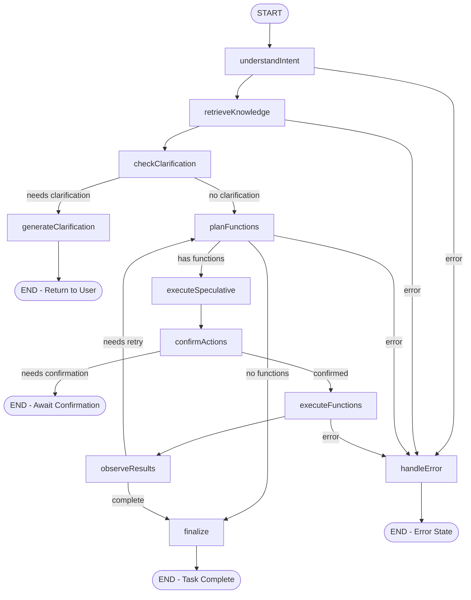

# LangGraph State Machines - Complex Task Orchestration

This directory contains LangGraph-based state machines that orchestrate complex multi-step tasks using stateful conversation patterns.

## Overview

LangGraph state machines provide deterministic, observable, and resumable execution for complex AI workflows. Each graph represents a complete conversation flow with well-defined states, transitions, and decision points.

## Universal Agent Graph

The `UniversalAgent.graph.ts` implements the main state machine for complex multi-step tasks like:

> *"Find me EDM/House concerts by the sea near me this summer and add 2 tickets to cart"*

### State Machine Architecture



### State Definitions

#### Core State Structure

```typescript
const UniversalAgentState = Annotation.Root({
  // Session & Identity
  sessionId: Annotation<string>(),
  siteId: Annotation<string>(),
  tenantId: Annotation<string>(),
  userId: Annotation<string | null>(),
  
  // Conversation Flow
  userInput: Annotation<string>(),
  messages: Annotation<BaseMessage[]>(),
  slotFrame: Annotation<SlotFrame | null>(),
  conversationContext: Annotation<ConversationContext>(),
  
  // Clarification & Confirmation
  needsClarification: Annotation<boolean>(),
  clarificationQuestion: Annotation<string | null>(),
  needsConfirmation: Annotation<boolean>(),
  confirmationReceived: Annotation<boolean>(),
  
  // Knowledge Retrieval
  searchResults: Annotation<Array<SearchResult>>(),
  
  // Function Calling & Execution
  availableActions: Annotation<SiteAction[]>(),
  functionCallResult: Annotation<FunctionCallResult | null>(),
  executedTools: Annotation<ExecutedTool[]>(),
  
  // Results & Performance
  finalResponse: Annotation<string | null>(),
  performanceMetrics: Annotation<PerformanceMetrics>(),
  error: Annotation<string | null>()
});
```

### Node Implementations

#### 1. `understandIntent` - Slot Frame Extraction

Converts natural language into structured slot frames:

```typescript
private async understandIntent(state: UniversalAgentStateType): Promise<Partial<UniversalAgentStateType>> {
  const slotFrame = await conversationFlowManager.parseUserIntent(
    state.userInput,
    state.conversationContext
  );
  
  const messages = [...state.messages, new HumanMessage(state.userInput)];
  
  logger.info('Intent understood', {
    intent: slotFrame.intent,
    extractedSlots: Object.keys(slotFrame.extractedSlots).length,
    missingSlots: slotFrame.missingSlots.length
  });
  
  return { slotFrame, messages };
}
```

**Key Features:**

- Multi-extractor slot parsing (temporal, spatial, categorical, quantitative)
- Intent classification with confidence scoring
- Context-aware slot normalization
- Missing slot detection

#### 2. `retrieveKnowledge` - Hybrid Search & RAG

Performs knowledge retrieval using hybrid search with RRF fusion:

```typescript
private async retrieveKnowledge(state: UniversalAgentStateType): Promise<Partial<UniversalAgentStateType>> {
  const searchQuery = this.buildSearchQuery(state.userInput, state.slotFrame);
  
  const searchRequest: HybridSearchRequest = {
    tenantId: state.tenantId,
    siteId: state.siteId,
    query: searchQuery,
    topK: 8,
    locale: state.conversationContext.userPreferences?.language || 'en',
    strategies: ['vector', 'fulltext', 'structured'],
    fusionOptions: { minConsensus: 2, maxResults: 8 }
  };

  const searchResult = await hybridSearchService.search(searchRequest);
  
  // Analytics tracking for search performance
  await analyticsHelpers.trackHybridSearch(/* ... */);
  await analyticsHelpers.trackRAGQuality(/* ... */);
  
  return { searchResults: searchResult.items };
}
```

**Key Features:**

- Vector similarity search with pgvector
- Full-text search with PostgreSQL FTS
- Structured data querying (JSON-LD events)
- Reciprocal Rank Fusion (RRF) result merging
- Real-time analytics tracking

#### 3. `checkClarification` - Dialog Management

Determines if clarification questions are needed:

```typescript
private async checkClarification(state: UniversalAgentStateType): Promise<Partial<UniversalAgentStateType>> {
  if (!state.slotFrame || state.slotFrame.missingSlots.length === 0) {
    return { needsClarification: false };
  }
  
  // Check if we have enough information to proceed
  const criticalSlotsMissing = state.slotFrame.missingSlots.filter(slot => 
    this.isCriticalSlot(slot, state.slotFrame.intent)
  );
  
  if (criticalSlotsMissing.length > 0) {
    const clarificationQuestion = await conversationFlowManager.generateClarificationQuestion(
      state.slotFrame,
      state.searchResults
    );
    
    return {
      needsClarification: true,
      clarificationQuestion,
      finalResponse: clarificationQuestion
    };
  }
  
  return { needsClarification: false };
}
```

**Decision Logic:**

- Prioritize critical slots (required for task completion)
- Generate contextual clarification questions
- Support single-question optimization
- Handle progressive slot filling

#### 4. `planFunctions` - Action Planning

Plans function calls based on intent and available knowledge:

```typescript
private async planFunctions(state: UniversalAgentStateType): Promise<Partial<UniversalAgentStateType>> {
  if (!state.slotFrame) {
    return { functionCallResult: null };
  }
  
  // Build action request from slot frame
  const actionRequest = this.buildActionRequest(state.slotFrame, state.searchResults);
  
  const functionPlan = await this.dependencies.functionCallingService.planFunctionCalls(
    actionRequest,
    state.availableActions,
    {
      confirmationRequired: this.requiresConfirmation(state.slotFrame.intent),
      riskTolerance: 'medium',
      maxFunctions: 5
    }
  );
  
  return {
    functionCallResult: functionPlan,
    needsConfirmation: functionPlan.requiresConfirmation
  };
}
```

**Planning Strategies:**

- Intent-to-action mapping
- Risk assessment integration
- Multi-step action sequencing
- Confirmation requirement detection

#### 5. `executeSpeculative` - Latency Hiding

Executes safe actions optimistically while planning continues:

```typescript
private async executeSpeculative(state: UniversalAgentStateType): Promise<Partial<UniversalAgentStateType>> {
  if (!state.functionCallResult) {
    return {};
  }
  
  // Filter for low-risk actions that can be executed speculatively
  const safeActions = state.functionCallResult.toolCalls.filter(call => 
    call.riskLevel === 'low' && 
    this.isSafeForSpeculativeExecution(call.function)
  );
  
  const speculativeResults = [];
  
  for (const action of safeActions) {
    try {
      const result = await this.executeSpeculativeAction(action, state);
      speculativeResults.push(result);
      
      logger.debug('Speculative action executed', {
        action: action.function,
        success: result.success
      });
    } catch (error) {
      logger.warn('Speculative action failed', {
        action: action.function,
        error: error instanceof Error ? error.message : 'Unknown error'
      });
    }
  }
  
  return { 
    executedTools: [...state.executedTools, ...speculativeResults]
  };
}
```

**Speculative Actions:**

- Navigation to likely pages
- Search result pre-loading
- UI element highlighting
- Cache warming operations

#### 6. `executeFunctions` - Tool Execution

Executes confirmed function calls with full safety measures:

```typescript
private async executeFunctions(state: UniversalAgentStateType): Promise<Partial<UniversalAgentStateType>> {
  const toolCallIds = state.functionCallResult.toolCalls.map(tc => tc.id);
  
  const executions = await this.dependencies.functionCallingService.executeFunctionCalls(
    state.sessionId,
    toolCallIds,
    state.confirmationReceived
  );
  
  const executedTools = executions.map(execution => ({
    toolName: execution.actionName,
    parameters: execution.parameters,
    result: execution.result?.data,
    success: execution.result?.success || false,
    executionTime: execution.result?.executionTime || 0,
    timestamp: new Date()
  }));
  
  // Track analytics for each tool execution
  for (const tool of executedTools) {
    await analyticsHelpers.trackToolExecution(/* ... */);
  }
  
  return { executedTools: [...state.executedTools, ...executedTools] };
}
```

#### 7. `finalize` - Response Generation

Generates final user response with citations and UI hints:

```typescript
private finalize(state: UniversalAgentStateType): Partial<UniversalAgentStateType> {
  const response = this.buildFinalResponse(state);
  
  return {
    finalResponse: response.text,
    messages: [...state.messages, new AIMessage(response.text)]
  };
}

private buildFinalResponse(state: UniversalAgentStateType): FinalResponse {
  const executedActions = state.executedTools.filter(tool => tool.success);
  
  if (executedActions.length === 0) {
    return {
      text: "I couldn't complete your request. Would you like me to try a different approach?",
      citations: [],
      uiHints: {}
    };
  }
  
  // Build contextual response based on executed actions
  const responseTemplates = this.getResponseTemplates(state.slotFrame?.intent);
  const response = this.populateResponseTemplate(responseTemplates, {
    actions: executedActions,
    searchResults: state.searchResults,
    slotFrame: state.slotFrame
  });
  
  return response;
}
```

### Advanced Features

#### Conditional Edges & Flow Control

```typescript
// Dynamic routing based on state conditions
workflow.addConditionalEdges('observeResults', (state: UniversalAgentStateType) => {
  if (state.error) return 'handleError';
  
  // Check if we need more steps
  const lastExecution = state.executedTools[state.executedTools.length - 1];
  if (!lastExecution?.success && state.slotFrame?.missingSlots.length === 0) {
    return 'planFunctions'; // Retry with different approach
  }
  
  // Check for incomplete multi-step tasks
  if (this.hasIncompleteChainedActions(state)) {
    return 'planFunctions'; // Continue the chain
  }
  
  return 'finalize'; // Task complete
});
```

#### Memory & State Persistence

```typescript
// LangGraph uses MemorySaver for state persistence
const memory = new MemorySaver();
const graph = workflow.compile({
  checkpointer: memory,
  interruptBefore: ['confirmActions'], // Human-in-the-loop checkpoints
  interruptAfter: ['checkClarification'] // Allow user input collection
});

// Resume interrupted conversations
const resumeConfig = {
  configurable: {
    thread_id: sessionId,
    checkpoint_ns: 'universal_agent'
  }
};
```

#### Error Handling & Recovery

```typescript
private async handleError(state: UniversalAgentStateType): Promise<Partial<UniversalAgentStateType>> {
  const error = state.error || 'Unknown error occurred';
  
  // Categorize error for appropriate recovery
  const errorCategory = this.categorizeError(error);
  
  let recoveryResponse: string;
  
  switch (errorCategory) {
    case 'validation_error':
      recoveryResponse = "I need some clarification to help you better. " + 
                        this.generateClarificationFromError(state);
      break;
      
    case 'availability_error':
      recoveryResponse = "It looks like what you're looking for isn't available. " +
                        "Let me suggest some alternatives.";
      break;
      
    case 'permission_error':
      recoveryResponse = "I don't have permission to complete that action. " +
                        "You may need to authorize this request first.";
      break;
      
    default:
      recoveryResponse = "I ran into an issue completing your request. " +
                        "Would you like me to try a different approach?";
  }
  
  return {
    finalResponse: recoveryResponse,
    messages: [...state.messages, new AIMessage(recoveryResponse)]
  };
}
```

## Performance Optimizations

### 1. Parallel Node Execution

```typescript
// Execute independent operations in parallel
const [slotFrame, searchResults] = await Promise.all([
  conversationFlowManager.parseUserIntent(input, context),
  hybridSearchService.search(searchRequest)
]);
```

### 2. Result Caching

```typescript
// Cache expensive operations
const cacheKey = `intent_${hash(userInput)}_${context.language}`;
let slotFrame = await this.intentCache.get(cacheKey);

if (!slotFrame) {
  slotFrame = await conversationFlowManager.parseUserIntent(input, context);
  await this.intentCache.set(cacheKey, slotFrame, { ttl: 300000 });
}
```

### 3. Speculative Execution

```typescript
// Start safe actions while waiting for confirmations
const speculativePromise = this.executeSpeculativeActions(lowRiskActions);
const userConfirmation = await this.waitForConfirmation(timeout);

if (userConfirmation.confirmed) {
  await Promise.all([speculativePromise, this.executeHighRiskActions(highRiskActions)]);
}
```

## Testing & Debugging

### Graph Visualization

```typescript
// Generate Mermaid diagram for debugging
const graphVisualization = await graph.getGraphVisualization();
console.log(graphVisualization.mermaid);
```

### State Inspection

```typescript
// Inspect state at any checkpoint
const checkpoint = await graph.getState(config);
console.log('Current state:', checkpoint.values);
console.log('Next steps:', checkpoint.next);
```

### Unit Testing Nodes

```typescript
describe('UniversalAgent Nodes', () => {
  test('understandIntent extracts complex slots', async () => {
    const mockState = { 
      userInput: "Find EDM concerts by the sea this summer",
      conversationContext: mockContext
    };
    
    const result = await universalAgent.understandIntent(mockState);
    
    expect(result.slotFrame.intent).toBe('buy_tickets');
    expect(result.slotFrame.extractedSlots.genre).toContain('electronic');
    expect(result.slotFrame.extractedSlots.venue_features).toContain('waterfront');
  });
});
```

## Configuration & Deployment

### Graph Configuration

```typescript
const universalAgentConfig = {
  // Node timeouts
  nodeTimeouts: {
    understandIntent: 5000,
    retrieveKnowledge: 10000,
    planFunctions: 3000,
    executeFunctions: 30000
  },
  
  // Retry policies
  retryPolicy: {
    maxRetries: 2,
    retryableNodes: ['retrieveKnowledge', 'executeFunctions']
  },
  
  // Performance targets
  performanceTargets: {
    totalExecutionTime: 15000,
    firstResponseTime: 1000
  }
};
```

### Production Considerations

1. **Checkpointing**: Use Redis for distributed state persistence
2. **Monitoring**: Comprehensive observability with OpenTelemetry
3. **Scaling**: Horizontal scaling with session affinity
4. **Error Recovery**: Graceful degradation and fallback strategies
5. **Security**: Validate all state transitions and user inputs

This graph architecture provides robust, observable, and scalable execution for complex conversational AI tasks with enterprise-grade reliability and performance.
